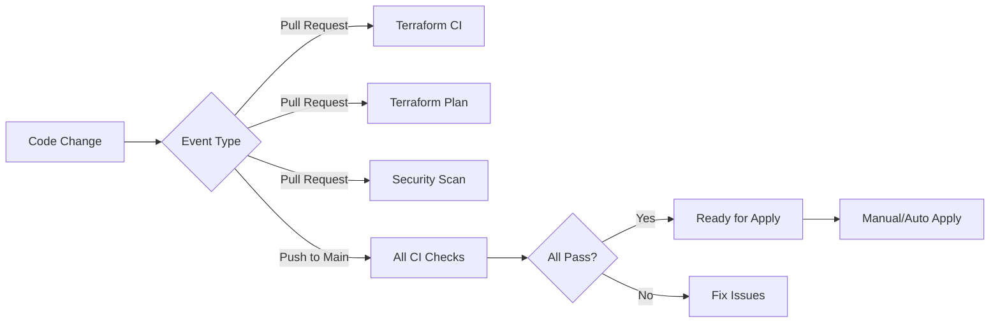

# GitHub Actions CI/CD Workflows

Tài liệu này mô tả các workflows CI/CD cho dự án Terraform.

## 📋 Tổng quan Workflows

### 1. **Security Scan - Checkov** (`main.yml`)
**Mục đích:** Quét bảo mật cho Terraform code

**Khi chạy:**
- Pull Request → branch `main`
- Push → branch `main`
- Mỗi tuần Chủ nhật (scheduled)

**Chức năng:**
- ✅ Quét code Terraform với Checkov
- ✅ Sử dụng custom security policies từ `policies/checkov/custom_rules`
- ✅ Upload kết quả vào GitHub Security tab
- ✅ Comment kết quả vào Pull Request
- ✅ Lưu báo cáo JSON và SARIF
- ✅ Fail pipeline nếu có lỗi bảo mật

**Artifacts:**
- `checkov-report/` - JSON và SARIF reports (lưu 30 ngày)

---

### 2. **Terraform CI - Validation & Format** (`terraform-ci.yml`)
**Mục đích:** Kiểm tra format và validate Terraform code

**Khi chạy:**
- Pull Request hoặc Push khi có thay đổi file `.tf`

**Chức năng:**
- ✅ Kiểm tra Terraform formatting (`terraform fmt`)
- ✅ Validate syntax (`terraform validate`)
- ✅ Comment kết quả vào Pull Request
- ✅ Fail nếu code không đúng format hoặc invalid

**Yêu cầu:**
- Code phải được format đúng: `terraform fmt -recursive`
- Terraform syntax phải hợp lệ

---

### 3. **Terraform Plan** (`terraform-plan.yml`)
**Mục đích:** Hiển thị Terraform plan trong Pull Request

**Khi chạy:**
- Pull Request khi có thay đổi file `.tf`

**Chức năng:**
- ✅ Chạy `terraform plan`
- ✅ Hiển thị plan details trong PR comment
- ✅ Giúp reviewer xem trước những thay đổi infrastructure

**Output:**
- Plan được hiển thị trong PR comment (có thể collapse/expand)

---

### 4. **Terraform Apply** (`terraform-apply.yml`)
**Mục đích:** Apply Terraform changes (deployment)

**Khi chạy:**
- Push → branch `main` (khi có thay đổi `.tf`)
- Manual trigger qua workflow_dispatch

**Chức năng:**
- ✅ Chạy `terraform plan`
- ⚠️ Terraform apply hiện đang **DISABLED** để an toàn
- ✅ Hỗ trợ manual deployment cho các environments: demo, staging, production

**Lưu ý an toàn:**
```yaml
# Auto-apply hiện đang tắt (if: false)
# Để bật, thay đổi điều kiện trong file terraform-apply.yml
```

---

## 🚀 Workflow Pipeline Flow



## 📊 Status Badges

Thêm badges vào README.md:

```markdown


```

## 🔧 Cấu hình

### Required Permissions
Workflows cần các permissions sau:
- `contents: read` - Đọc code
- `security-events: write` - Upload security findings
- `pull-requests: write` - Comment vào PRs

### Secrets cần thiết
Hiện tại chỉ cần `GITHUB_TOKEN` (tự động có sẵn).

Nếu deploy thật, cần thêm:
- `AWS_ACCESS_KEY_ID` (cho AWS)
- `AWS_SECRET_ACCESS_KEY`
- Hoặc cloud provider credentials tương ứng

## 📝 Cách sử dụng

### Quy trình phát triển thông thường:

1. **Tạo branch mới:**
   ```bash
   git checkout -b feature/my-feature
   ```

2. **Viết Terraform code:**
   ```bash
   # Viết code trong demo/
   terraform fmt -recursive
   terraform validate
   ```

3. **Commit và push:**
   ```bash
   git add .
   git commit -m "feat: add new resource"
   git push origin feature/my-feature
   ```

4. **Tạo Pull Request:**
   - Workflows sẽ tự động chạy
   - Kiểm tra comments từ bots:
     - ✅ Format check
     - ✅ Validation check
     - ✅ Security scan
     - ✅ Terraform plan

5. **Review và merge:**
   - Đảm bảo tất cả checks pass
   - Review plan output
   - Merge vào main

6. **Deploy (nếu cần):**
   - Tự động: Push vào main (khi bật auto-apply)
   - Manual: Chạy workflow_dispatch

## 🔒 Security Features

1. **Checkov Integration:**
   - Custom security rules
   - GitHub Security tab integration
   - SARIF format support

2. **Plan Review:**
   - Xem trước thay đổi infrastructure
   - Prevent unexpected changes

3. **Validation:**
   - Syntax checking
   - Format enforcement

## 🎯 Best Practices

1. ✅ **Luôn format code:** `terraform fmt -recursive`
2. ✅ **Test local trước:** `terraform validate`
3. ✅ **Review plan output** trong PR
4. ✅ **Fix security issues** ngay khi phát hiện
5. ✅ **Không skip checks** khi merge PR
6. ✅ **Review custom policies** định kỳ

## 🐛 Troubleshooting

### Workflow fails với "format check failed"
```bash
# Fix bằng cách chạy:
terraform fmt -recursive
git add .
git commit -m "fix: format terraform files"
git push
```

### Security scan fails
- Xem chi tiết trong GitHub Security tab
- Check file reports/checkov.json trong artifacts
- Fix theo hướng dẫn của Checkov

### Plan fails
- Check terraform validate locally
- Xem logs chi tiết trong workflow run
- Đảm bảo dependencies được init đúng

## 📚 Resources

- [Terraform GitHub Actions](https://github.com/hashicorp/setup-terraform)
- [Checkov Documentation](https://www.checkov.io/)
- [GitHub Actions Documentation](https://docs.github.com/actions)

## 🔄 Cập nhật sau này

Có thể mở rộng với:
- [ ] Terraform state management (S3/GCS backend)
- [ ] Multi-environment deployments
- [ ] Cost estimation (Infracost)
- [ ] Terraform docs generation
- [ ] Drift detection
- [ ] Slack/Teams notifications
